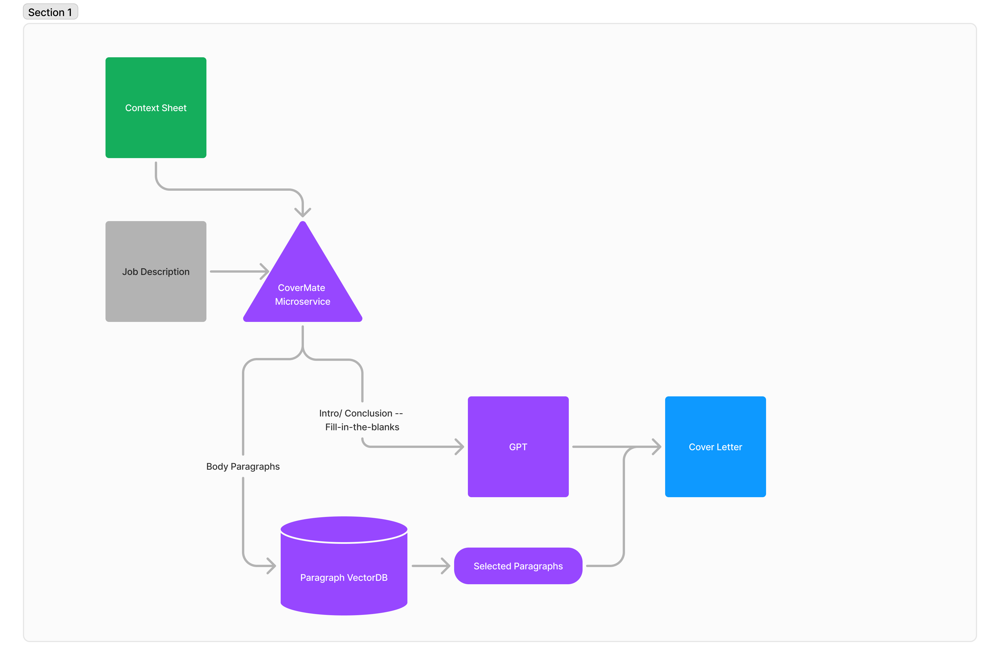

### CoverMate: Your AI-Powered Cover Letter Assistant ✨
Job applications can be time-consuming, especially when crafting custom cover letters. CoverMate automates this process, saving you hours of effort. CoverMate is a Google Docs add-on designed to auto-generate cover letters based on job descriptions. Simply copy and paste the job posting into a new Google Doc, activate the add-on, and let CoverMate do the rest!

### DEMO:

**User Flow:**
* 📝 Copy/Paste Job Description: Insert the job description into a new Google Doc.
* ⚡ Generate Cover Letter: Activate CoverMate to create a tailored cover letter using predefined templates and paragraphs.
* 🔍 Edit and Submit: Review, edit, and finalize your cover letter for submission.

**Context Sheet:** A separate Google Sheet with predefined body paragraphs and a template for quick integration. To define your Context sheet, make a copy of [this google sheet](https://docs.google.com/spreadsheets/d/1Mnm81YBCE6kH6mdiBIpssP-Uc9pOQ2ZDtodY5atSSNU/edit?usp=sharing).

**Microservice Functionality:**
Vector Database Creation: Automatically generate a vector database of body paragraph candidates from your Context Doc.
Paragraph Autofill: Identify and auto-fill the most relevant paragraphs for the job description.
Template Integration: Seamlessly integrate introductory and concluding paragraphs with job-specific details.
